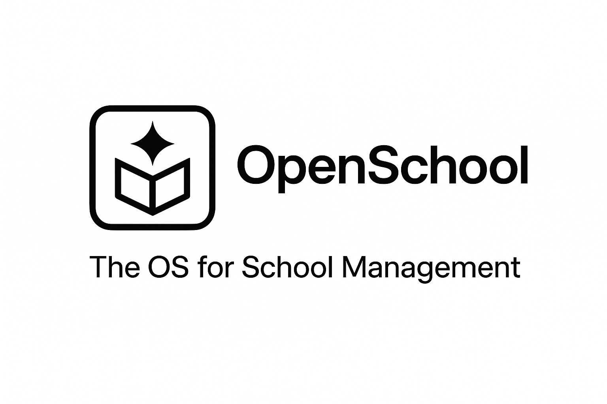

<p align="center">
	<h1 align="center"><b>OpenSchool</b></h1>
<p align="center">
    The OS for School Management
    <br />
    <br />
    <a href="https://github.com/joshua-sx/openschool-v2/issues">Issues</a>
  </p>
</p>

<p align="center">
  <a href="https://supabase.com">
    
  </a>
  <a href="https://nextjs.org">
    
  </a>
  <a href="https://bun.sh">
    
  </a>
</p>

## About OpenSchool

OpenSchool is a modern K-12 school management platform built for developing and semi-digital contexts. It helps organizations manage multiple schools under one main account, with each school managing classes, students, and staff.

## Features

**Student Management**: Comprehensive student profiles with enrollment tracking, academic history, and parent contact management for complete digital student records.<br/>
**Smart Gradebook**: Intuitive grading system with automated calculations, assignment distribution, and real-time progress updates for teachers.<br/>
**Advanced Analytics**: Data-driven insights into student performance with visual dashboards, trend analysis, and custom reports for administrators.<br/>
**Multi-school organizations**: One organization can manage many schools, each with their own classes and data.<br/>
**Role-based access**: Different user types get the right level of access (admins, teachers, parents, students).<br/>

## Get started

We are working on comprehensive documentation. For local development setup, see [LOCAL_DEV.md](./LOCAL_DEV.md).

### Quick Start

```bash
# Clone the repository
git clone https://github.com/joshua-sx/openschool-v2.git
cd openschool-v2

# Install dependencies
bun install

# Set up environment variables
bash scripts/setup-env.sh

# Set up localhost entries
bash scripts/setup-localhost.sh

# Run migrations
bun run db:migrate

# Start development server
bun run dev
```

## App Architecture

- **Monorepo**: Turborepo
- **Runtime**: Bun
- **Frontend**: Next.js + React + TypeScript
- **Database**: Supabase (Postgres)
- **UI**: shadcn/ui + TailwindCSS
- **Auth**: Supabase Auth + role-based permissions

### Hosting

- **Supabase** (database, auth)
- **Vercel** (web app)

### Services

- **GitHub Actions** (CI/CD)

## Security & Compliance

OpenSchool is built with security and compliance in mind:

- **Access control**: Permission checks to prevent unauthorized actions
- **Audit logging**: Track key actions for accountability
- **Education data privacy**: Built with student data protection in mind

## Project Structure

```
openschool-v2/
├── apps/
│   ├── web/                    # Next.js web application
│   └── api/                    # Standalone API server (planned)
├── packages/
│   ├── db/                     # Database schema & migrations
│   ├── rbac/                   # Role-based access control
│   ├── auth/                   # Authentication utilities
│   ├── audit/                  # Audit logging
│   ├── ui/                     # Shared UI components
│   └── config/                 # Shared configurations
├── scripts/                    # Build & utility scripts
└── docs/                       # Documentation
```

## Development

```bash
# Run all apps
bun run dev

# Run specific app
bun run dev --filter=web

# Type check
bun run typecheck

# Lint
bun run lint

# Build
bun run build
```

## Database

```bash
# Generate types after schema changes
bun run db:generate

# Run migrations
bun run db:migrate

# Seed database
bun run db:seed

# Open Drizzle Studio
bun run db:studio
```

## Repo Activity


## License

License is not finalized yet. If you plan to deploy OpenSchool commercially, please open an issue to discuss licensing.
