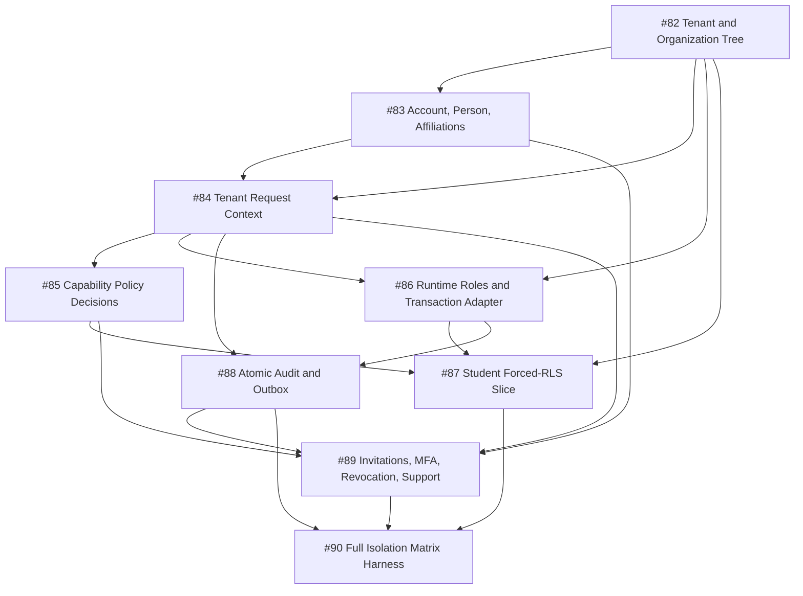

# M1 tenant security implementation plan

- Milestone: [M1 — Tenant security foundation](https://github.com/joshua-sx/openschool-v2/milestone/2)
- Epic: [#81](https://github.com/joshua-sx/openschool-v2/issues/81)
- Governing decision package: #68
- Product state throughout: pre-production; no real school data

## Dependency graph

## Implementation phases

| Phase | Issues | Deliverable | Merge/rollback boundary |
| --- | --- | --- | --- |
| 1. Isolation keys | #82 | Tenant, placement, Organization Tree, School governance, staged backfill | stop before non-null cutover; after cutover restore or forward-fix |
| 2. Identity records | #83 | Account/Person separation and effective Affiliations/Relationships | dual-read; legacy records remain until parity |
| 3. Trusted context | #84 | verified identity and canonical Tenant Request Context | compare in development; production fails closed |
| 4. Enforcement modules | #85 and #86 | Policy Decision module plus non-owner transaction adapter | versioned policy rollback; never owner-bypass DB access |
| 5. Evidence and audit | #87 and #88 | forced-RLS student vertical slice and atomic audit/outbox | slice feature flag; audit never disabled/deleted |
| 6. Privileged identity | #89 | invitation, MFA, revocation, support/break-glass | pause invites only; revocation/MFA/audit remain |
| 7. System proof | #90 | full cross-path Isolation Matrix and automated NO-GO gate | security failures disable feature/release, not tests |

## Execution rules

1. No issue changes production RLS/schema behavior before its governing ADR is merged.
2. Every schema migration has clean, existing-fixture, negative-constraint, rollback, and second-run evidence.
3. Every authorization/data-path issue includes valid identifiers from another Tenant and sibling scope.
4. Each pull request is independently reviewable and keeps the application pre-production.
5. Product epics #2–#6 do not expand protected data paths until #87 proves the first complete slice.
6. Jurisdiction-specific privacy/legal decisions remain named human approvals in the Production Gate, never inferred from passing code.
