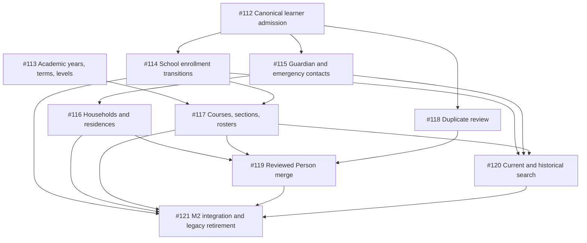

# M2 authoritative SIS and academic core implementation plan

- Milestone: [M2 — Authoritative SIS and academic structure](https://github.com/joshua-sx/openschool-v2/milestone/3)
- Epic: [#111](https://github.com/joshua-sx/openschool-v2/issues/111)
- Governing identity decision: [ADR-0003](../adr/0003-person-account-and-affiliations.md)
- Product state throughout: pre-production; no real school data

## Outcome

M2 replaces the legacy `students` record as application authority with a Tenant-scoped Student
Information System built from People, Student Profiles, effective School enrollments, explicit
relationships, academic structure, and section rosters. The same primitives support a primary
School's homeroom model and a high School's subject-section model through configuration rather than
parallel products.

M2 is not a general admissions, attendance, gradebook, scheduling, or parent-portal release. It
creates the authoritative identity, enrollment, relationship, academic-cycle, and roster boundary
those modules need.

## Domain boundaries

| Concept | Owns | Does not own |
| --- | --- | --- |
| Person | Tenant-scoped human identity and stable biographical facts | authentication, School membership, class membership |
| Student Profile | learner-specific facts for a Person | enrollment state, household membership |
| School Enrollment | effective membership and lifecycle in a School | course or section placement |
| Affiliation | authorization-relevant effective role/scope | academic enrollment history |
| Person Relationship | guardianship, contact, pickup, and portal-eligibility facts | household residence, automatic Account access |
| Household and Residence | shared living unit, address, and effective residence | custody, guardianship, authorization |
| Academic Year and Term | versioned instructional time boundary | timetable periods or events |
| Learner Level | configurable grade/year/stage classification | School enrollment itself |
| Course and Section | curriculum offering and scheduled teaching cohort | legal School enrollment |
| Section Roster | effective learner membership in a Section | Person identity or School lifecycle |

## Dependency graph

## Delivery slices

| Order | Issue | Tracer-bullet outcome | State transition |
| --- | --- | --- | --- |
| 1 | [#112](https://github.com/joshua-sx/openschool-v2/issues/112) | admit and view one learner through canonical records | canonical read authority with a measured legacy compatibility mirror |
| 2 | [#113](https://github.com/joshua-sx/openschool-v2/issues/113) | configure one academic year, term, and learner-level set | no academic authority to versioned School configuration |
| 3 | [#114](https://github.com/joshua-sx/openschool-v2/issues/114) | enroll, withdraw, transfer within a Tenant, graduate, and re-enroll | **Implemented:** mutable Student status to append-only School history |
| 4 | [#115](https://github.com/joshua-sx/openschool-v2/issues/115) | link guardians and emergency contacts with explicit powers | **Implemented:** informal contact fields to effective relationships and explicit portal eligibility |
| 5 | [#116](https://github.com/joshua-sx/openschool-v2/issues/116) | represent multiple households and residences | **Implemented:** one-household assumptions to versioned residence, mailing, and sibling-membership history |
| 6 | [#117](https://github.com/joshua-sx/openschool-v2/issues/117) | create courses/sections and roster enrolled learners | **Implemented:** class schema placeholders to effective, authoritative rosters with legacy parity evidence |
| 7 | [#118](https://github.com/joshua-sx/openschool-v2/issues/118) | review explainable possible duplicates without mutation | **Implemented:** hidden duplicate risk to a conservative, versioned, approval-only queue |
| 8 | [#119](https://github.com/joshua-sx/openschool-v2/issues/119) | approve and execute a controlled same-Tenant Person merge | manual repair to audited compensating workflow |
| 9 | [#120](https://github.com/joshua-sx/openschool-v2/issues/120) | search current and historical learners at authorized scope | client filtering to server-owned pagination and scope |
| 10 | [#121](https://github.com/joshua-sx/openschool-v2/issues/121) | prove the joined SIS journey and retire legacy authority | compatibility mode to supported canonical boundary |

## Shared primary and high School model

School configuration selects terminology and scheduling complexity; it does not select a different
data model. A primary School may use one year-long homeroom Section whose Course represents the
general curriculum. A high School may use many term-bound Sections, subject Courses, teacher
assignments, and credit metadata. Both rely on the same Person, School Enrollment, Academic Year,
Term, Learner Level, Section, and Section Roster records.

Country-specific labels such as grade, year, form, standard, or stage are presentation
configuration. They must not become schema columns or authorization branches.

## Security and integrity invariants

1. Every M2 record carries an authoritative `tenant_id`; School-scoped records also carry or
   securely derive a School constraint that is enforced by policy and forced RLS.
2. Cross-Tenant references are rejected by composite keys or equivalent database constraints, not
   only application validation.
3. A learner may have one primary current School Enrollment per Tenant and time instant, while
   explicitly modeled concurrent or secondary enrollments remain possible.
4. Historical enrollment, relationship, residence, and roster facts are closed with effective
   dates; ordinary workflows do not delete them.
5. Guardian relationship, legal authority, emergency priority, pickup authority, portal
   eligibility, household residence, and Account access are independent facts.
6. Creating a Person or relationship never provisions access automatically. Account Link and
   invitation controls from M1 remain the authentication boundary.
7. Duplicate detection is Tenant-local and explainable. Merges require preview, strong
   authentication, a distinct approver, durable aliases, and a compensating reversal plan.
8. Every read and mutation uses verified Tenant Request Context, capability decisions, a
   non-owner transaction role, atomic audit/outbox evidence, and explicit sibling-School and
   cross-Tenant denial tests.

## Migration and rollback

M2 uses expand, backfill, compare, cut over, and contract:

1. Add canonical records and constraints without changing supported legacy reads.
2. Backfill deterministically with stable source identifiers and idempotent checkpoints.
3. Dual-write only through one reviewed service boundary; compare field and count parity.
4. Move reads by capability behind a reversible flag after parity and isolation evidence pass.
5. Make the legacy representation read-only or mechanically derived before removing write paths.
6. Contract legacy storage only after the M2 integration story passes and a separately reviewed
   rollback window has expired.

Rollback returns reads to the last parity-proven representation. It never deletes new historical or
audit evidence and never re-enables an unisolated data path.

## M2 exit criteria

- The canonical SIS journey in #121 passes on disposable PostgreSQL with real application
  identities and forced RLS.
- Platform, Organization, School, teacher, guardian, and learner contexts have explicit allowed and
  denied matrix evidence, including sibling-School and cross-Tenant identifiers.
- Supported student create, update, list, detail, and search paths no longer treat legacy
  `students` as authority.
- Primary homeroom and high-School subject-section fixtures exercise the same schema and services.
- Migration parity, representative query plans, audit/outbox atomicity, accessibility, and
  end-to-end evidence pass in CI.
- No unresolved Critical or High security finding remains in the M2 surface.
- Capability status and production-readiness documentation name the supported boundary and all
  remaining production blockers.

Passing M2 is an engineering milestone, not approval to process real School data. Production
remains NO-GO until the target jurisdiction, identity provider, infrastructure, recovery,
retention, accessibility, security assessment, and customer-operations gates are approved.
