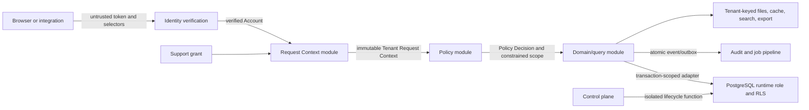

# Tenant security threat model

- Status: M1 governing baseline
- Owner: Security Engineering
- Last reviewed: 2026-08-02
- Review triggers: identity provider change, new data path, placement adapter, support model, jurisdiction, major incident

## Scope and security objectives

This model covers authentication through storage for the pooled OpenSchool placement implemented in M1, including API, query modules, PostgreSQL/RLS, files, caches, jobs, imports, exports, analytics, audit, and support access. Bridge and silo adapters are design seams only and are out of implementation scope; they must remain disabled in production until a placement-specific threat-model revision covers routing/control-plane compromise, credential and key separation, migration, backup/restore, monitoring, failover, residency, and the full Isolation Matrix through the new adapter. This model does not certify compliance with any jurisdiction.

Primary objectives:

1. prevent one Tenant, Organization Tree branch, School, class, guardian, or student from reading or mutating another scope;
2. prevent stale, forged, or confused context from becoming authorization state;
3. make privileged access explicit, time-bounded, attributable, and reviewable;
4. preserve confidentiality, integrity, availability, and recoverability of school records;
5. fail closed without making emergency recovery impossible.

## Assets and classification

| Asset | Examples | Minimum classification |
| --- | --- | --- |
| Identity and access | Accounts, MFA, invitations, affiliations, sessions, support grants | Restricted |
| Student/person records | Demographics, contacts, enrollment, guardians | Restricted |
| Safeguarding/health/discipline | Incidents, accommodations, medical and welfare notes | Highly restricted |
| Academic records | Assessments, grades, reports, credits, attendance | Restricted |
| Finance | Fees, payments, concessions, refunds | Restricted; payment data must remain with a compliant processor |
| Communications/files | Messages, attachments, consent forms, exports | Classification inherited from content |
| Security evidence | Audit events, policy decisions, alerts, backups | Restricted |
| Platform secrets | DB credentials, signing keys, provider secrets | Critical |

## Actors

- unauthenticated internet user;
- student, guardian, teacher, staff, school administrator, organization administrator;
- platform operator, approved support agent, break-glass operator;
- background worker and integration identity;
- compromised Account or endpoint;
- malicious or careless insider;
- attacker exploiting application, dependency, CI, cloud, or database configuration;
- external processor or integration with overbroad access.

## Trust seams and data flow

Every arrow is a validation seam. Browser selectors, JWT payloads before verification, import files, integration events, cache keys, job payloads, filenames, and support tickets are untrusted.

## Abuse cases and mitigations

| ID | Abuse case | Impact | Required prevention/detection | Verification |
| --- | --- | --- | --- | --- |
| T01 | Change Tenant/School headers to another customer | Cross-tenant disclosure | selectors validated by Request Context; query scope and RLS use resolved context | API and DB negative tests |
| T02 | Stale JWT retains revoked role | Unauthorized privileged action | verified claims plus server-side membership/session version; immediate invalidation | revocation race tests |
| T03 | First/strongest membership chosen implicitly | Confused deputy | explicit context or `CONTEXT_REQUIRED`; evaluate all current affiliations | multi-role tests |
| T04 | Organization admin escapes assigned subtree | Cross-school disclosure | explicit subtree grant, closure lookup, School/tree consistency | descendant/sibling tests |
| T05 | Missing tenant predicate in query | Whole-table disclosure | forced RLS on non-owner role plus approved Policy Decision scope | real-role RLS tests |
| T06 | Runtime uses owner/service credential | RLS bypass | separate credentials, role assertions at startup/CI, secret scanning | deployment and DB-role checks |
| T07 | Pooled connection retains previous context | Cross-request disclosure | transaction-local settings only; wrapper owns transaction | commit/rollback reset tests |
| T08 | Raw SQL changes context or bypasses query construction | Cross-tenant access | no user-controlled SQL, reviewed raw SQL allowlist, least privilege, bridge/silo for high assurance | static review and penetration test |
| T09 | RLS recursion or permissive policy composition | outage or overgrant | named roles, explicit operations, `USING`/`WITH CHECK`, policy lint and negative matrix | migration review and EXPLAIN |
| T10 | Foreign key/unique constraint leaks another Tenant's row | Existence disclosure | tenant-scoped composite keys/constraints and indistinguishable errors | constraint side-channel tests |
| T11 | Cache/search key omits Tenant | Cross-tenant result reuse | mandatory tenant namespace and policy version; no shared object cache | cache poisoning tests |
| T12 | Job payload forged or replayed | Cross-tenant mutation | signed/durable job envelope, Tenant re-resolution, idempotency, worker RLS | replay and wrong-tenant tests |
| T13 | File path or signed URL crosses Tenant | Document disclosure | opaque object IDs, Tenant metadata, authorization at issuance and retrieval, short TTL | object-store negative tests |
| T14 | Import references another School/Person | Integrity/disclosure | stage by Tenant, validate every foreign reference, preview, atomic apply | malicious import fixtures |
| T15 | Export created correctly but delivered broadly | Bulk disclosure | purpose/approval, least columns, encryption, expiry, download audit, step-up auth | export lifecycle tests |
| T16 | Audit write fails after mutation | Missing evidence | same transaction or durable outbox; fail required mutations closed | fault-injection tests |
| T17 | Audit stores excessive sensitive data | Secondary privacy breach | allowlisted/redacted summaries, retention class, restricted reader capability | schema/content tests |
| T18 | Support operator browses Tenant without approval | Insider disclosure | explicit support grant, MFA, scope, purpose, expiry, notification, audit | support grant negative tests |
| T19 | Break-glass becomes routine bypass | Persistent privileged access | separate custody, short TTL, alerting, mandatory post-event review | quarterly exercise |
| T20 | Backup/restore omits rows due to RLS or restores wrong Tenant | loss/cross-tenant disclosure | isolated backup role, `row_security=off` error behavior, restore drills, tenant verification | scheduled restore evidence |
| T21 | Analytics combines Tenants without lawful approval | Unauthorized profiling | governed export/data product, minimization, aggregation, contract/purpose approval | dataset lineage review |
| T22 | Dependency/CI compromise steals secrets | platform compromise | least-privilege CI, pinned actions/images, secret scanning, provenance, rotation | supply-chain controls |
| T23 | Denial-of-service through expensive hierarchical RLS | availability loss | closure tables, tenant-leading/indexed policy columns, query limits, plan regression tests | representative EXPLAIN/load tests |
| T24 | School transfer changes historical record visibility | integrity/disclosure | effective-dated governance and record context, privileged migration | historical access tests |
| T25 | Platform role becomes an implicit Tenant data bypass | national-scale disclosure | global grant store, Person-free policy context, no-table control-plane login, separate support grants | role and real-login negative tests |
| T26 | Tenant suspension races an admitted request or worker | post-suspension access | shared Tenant row lock on admission; conflicting lifecycle update; current status check | concurrent runtime/worker proof |

## Known residual risks

- A fully compromised shared runtime credential or arbitrary SQL execution can manipulate custom transaction settings. RLS is not the sole control; query construction, credential isolation, monitoring, and bridge/silo placement limit this risk.
- Cross-tenant national reporting may require a separate governed analytics design and jurisdiction-specific approval.
- Identity proofing strength, retention periods, data-subject rights, safeguarding access, and breach notification depend on launch jurisdiction and contracts.
- Availability targets, recovery objectives, and staffing are not yet approved customer commitments.

## Security review gates

- Any new data path must add rows to the Isolation Matrix before implementation.
- Any runtime role, RLS policy, security-definer function, support workflow, export, or cross-tenant process requires Security Engineering review.
- Threats rated cross-tenant, safeguarding, credential, backup, or bulk-export impact block production until evidence is accepted.
